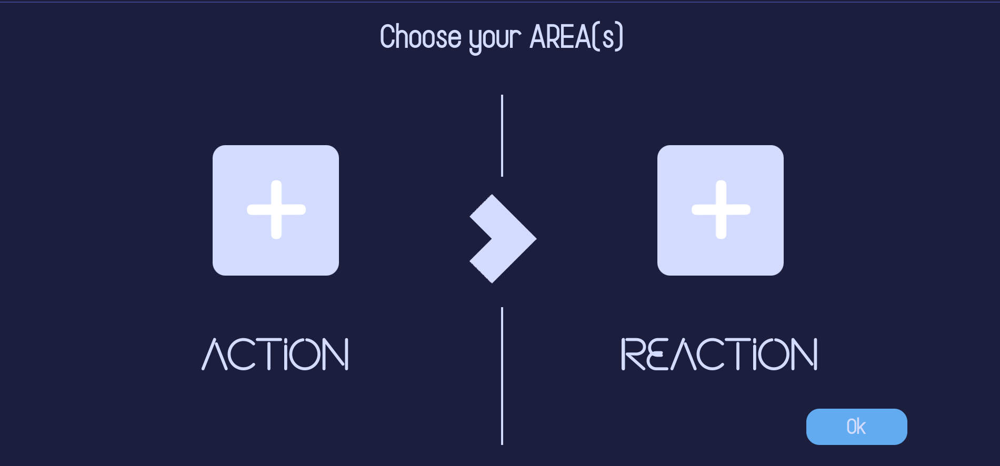

# 📲 What is it ?

Sending an email when someone has just published their work on the Github platform is quite doable with Area.

<figure><figcaption>
Main menu of application
</figcaption></figure>

<figure><figcaption>
Choose your action and your reactions
</figcaption></figure>

To do this, the application has two distinct parts: actions and reactions. An action that represents an event will cause one or more reactions. These actions and reactions correspond to events that you have chosen on the services offered by the Area application. These services are applications such as: Gmail, Google Drive, Outlook, Github and many others. The user will need to login and choose events. Actions and reactions are fully customisable and the user can therefore simplify their daily tasks as they see fit.

## User journey

For example, a user is waiting for an event attendance confirmation email to add the confirming person to a Google Calendar event. He does not know when this person will respond and would like, once confirmed, to add him to the event. He can therefore use the Area application. To do this, the user will be able to choose the action “Receive an email” from the target email address(es): user.example@e-mail.fake in the Gmail service and choose the reaction “Create an event” in the Google Calendar service.

## Video overview

Got 2 minutes? Check out a video overview of our product :

